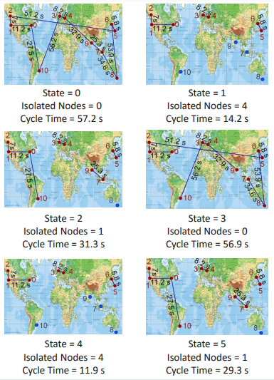

# Reducing Training Time in Cross-Silo Federated Learning using Multigraph Topology

Federated learning is an active research topic since it enables several participants to jointly train a model without sharing local data. Currently, cross-silo federated learning is a popular training setting that utilizes a few hundred reliable data silos with high-speed access links to training a model. While this approach has been widely applied in real-world scenarios, designing a robust topology to reduce the training time remains an open problem. In this paper, we present a new multigraph topology for cross-silo federated learning. We first construct the multigraph using the overlay graph. We then parse this multigraph into different simple graphs with isolated nodes. The existence of isolated nodes allows us to perform model aggregation without waiting for other nodes, hence effectively reducing the training time. Intensive experiments on three public datasets show that our proposed method significantly reduces the training time compared with recent state-of-the-art topologies while maintaining the accuracy of the learned model. 



This repository is the implementation of [MultigraphFL](https://arxiv.org/pdf/2207.09657.pdf) paper accepted in ICCV 2023. We benchmark our method on three public datasets: [Inaturalist](https://arxiv.org/abs/1707.06642), [FEMNIST](https://arxiv.org/abs/1812.01097), and [Sentiment-140](https://arxiv.org/abs/1812.01097).

This repository is based on and inspired by @Othmane Marfoq [work](https://github.com/omarfoq/communication-in-cross-silo-fl). We sincerely thank for their sharing of the codes.

### Prerequisites

PYTHON 3.6

CUDA 9.2

Please install dependence package by run following command:
```
pip install -r requirements.txt
```

### Datasets

* For FEMNIST dataset:

    * To download and preprocess them, please run:

        ```
        cd data/femnist
        bash download_preprocess.sh
        ```

    * To split the preprocessed dataset into silos for EXODUS network, please run:
 
        ```
        python3 split_data.py --num_workers 79
        ```
        With --num_workers: the number of workers (silos)
        
        | Network name | # Workers |
        |:------------:|:---------:|
        |     Gaia     |     11    |
        |    Amazon    |     22    |
        |     Géant    |     40    |
        |    Exodus    |     79    |
        |     Ebone    |     87    |
        
        We also provide the split FEMNIST dataset for EXODUS network at [link](https://vision.aioz.io/f/bc1b1216cb394ba0997d/?dl=1). You can download and extract them into "data/femnist/exodus" folder.
 * For iNaturalist dataset and Sentiment140 dataset:  please follow the instruction in [here](https://github.com/omarfoq/communication-in-cross-silo-fl)  
### Multigraph Networks and Topologies

Important: Before running any command lines in this section, please run following command to access 'graph_utils' folder:
```
cd graph_utils
```
And now, you are in 'graph_utils' folder.
* To generate baseline and multigraph networks for FEMNIST dataset and compute the cycle time for them:
    ```
    bash generate_network_femnist_table3.sh
    ```

* To generate baseline and multigraph networks for iNaturalist dataset and compute the cycle time for them:
    ```
    bash generate_network_inat_table3.sh
    ```

* To generate baseline and multigraph networks for Sentiment-140 dataset and compute the cycle time for them:
    ```
    bash generate_network_sent140_table3.sh
    ```

*<center>**Table 1**: Cycle time (ms) comparison between different typologies. (↓◦) indicates our reduced times compared with other methods (Table 3 in the main paper).</center>*

### Training

To train our method on FEMNIST dataset with EXODUS network, run:

```
bash train_femnist_exodus_multigraph-ring.sh
```

#### Pretrained models
We provide the pretrained models which are trained on FEMNIST dataset with EXODUS network by our method at the last epoch. Please download at [link](https://vision.aioz.io/f/3b5515295bd34efd9b6f/?dl=1) and extracted them into the "pretrained_models/FEMNIST_EXODUS_MULTIGRAPH-RING" folder. The models can be evaluted in FEMNIST train and test set via:
```
bash eval_femnist_exodus_multigraph-ring.sh 
```

### Citation

If you use this code as part of any published research, we'd really appreciate it if you could cite the following paper:

```
Updating
```

### License

MIT License